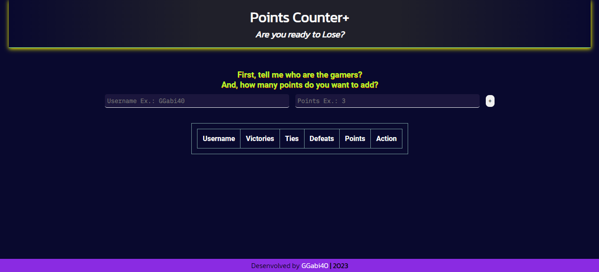

<h1>Points Counter</h1>

This project was maded for Alura's Challenge, 5 days coding JavaScript.

 
<h2>Points Counter+</h2>

 

<h2>📚Tecnologies:</h2>

<ul>
    <li>HTML</li>
    <li>CSS</li>
    <li>JavaScript</li>
    <li>Git and Github</li>
</ul>

<h2>💻Project:</h2>

This project aims to help people who play games that need to count points. Often, they don't have a paper available to use and this page is special to help them.

Visit the Project Online: <a href="https://ggabi40.github.io/PointsCounter">https://ggabi40.github.io/PointsCounter</a>

 

Desenvolved by GGabi40 | Inspired by Alura.
